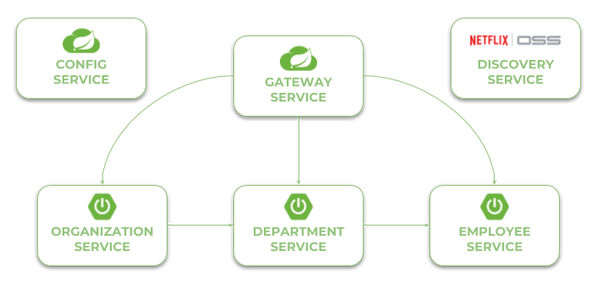

## Quick Guide to Microservices with Spring Boot 2.0, Eureka and Spring Cloud

    Using Spring Boot 2.0 in cloud-native development
    Providing service discovery for all microservices with Spring Cloud Netflix Eureka
    Distributed configuration with Spring Cloud Config
    API Gateway pattern using a new project inside Spring Cloud: Spring Cloud Gateway
    Correlating logs with Spring Cloud Sleuth

- [Discovery Service](http://localhost:18061/)
- [Proxy Service](http://localhost:18060/swagger-resources)
- [Swagger UI](http://localhost:18060/swagger-ui.html)

- [Organization Service](http://localhost:18092)
  - [thru Netflix Zuul Proxy](http://localhost:18060/organization/)
  - [thru Spring Cloud Gateway](http://localhost:18062/organization/)
  - [API Docs](http://localhost:18060/organization/v2/api-docs)

- [Department Service](http://localhost:18091)
  - [thru Netflix Zuul Proxy](http://localhost:18060/department/)
  - [thru Spring Cloud Gateway](http://localhost:18062/department/)
  - [API Docs](http://localhost:18060/department/v2/api-docs)

- [Employee Service](http://localhost:18090)
  - [thru Netflix Zuul Proxy](http://localhost:18060/employee/)
  - [thru Spring Cloud Gateway](http://localhost:18062/employee/)
  - [API Docs](http://localhost:18060/employee/v2/api-docs)
